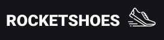

<h1 align="center">
    
    <br>
</h1>

<p align="center">
  <a href="#about">About</a>&nbsp;&nbsp;&nbsp;|&nbsp;&nbsp;&nbsp;
  <a href="#technologies">Technologies</a>&nbsp;&nbsp;&nbsp;|&nbsp;&nbsp;&nbsp;
  <a href="#how-to-use">How To Use</a>&nbsp;&nbsp;&nbsp;|&nbsp;&nbsp;&nbsp;
  <a href="#license">License</a>&nbsp;&nbsp;&nbsp;|&nbsp;&nbsp;&nbsp;
  <a href="#author">Author</a>
</p>

## About

E-commerce project developed at [Rocketseat GoStack Bootcamp](https://rocketseat.com.br/), where you can choose the products and add them to the cart, changing the quantity, viewing the subtotal and the total price of the actual order.

 

## Technologies

This project was developed with the following technologies:

- Common technologies:

  - [Redux](https://redux.js.org/)
  - [Redux-Saga](https://redux-saga.js.org/)
  - [Axios](https://github.com/axios/axios)
  - [styled-components](https://www.styled-components.com/)
  - [Immer](https://github.com/immerjs/immer)
  - [Reactotron](https://infinite.red/reactotron)
  - [json-server](https://github.com/typicode/json-server)

- Web:

  - [ReactJS](https://reactjs.org/)
  - [React Router v4](https://github.com/ReactTraining/react-router)
  - [Polished](https://polished.js.org/)
  - [React-Toastify](https://fkhadra.github.io/react-toastify/)
  - [React-Icons](https://react-icons.netlify.com/)

- Mobile:

  - [ReactNative](https://reactnative.dev/)
  - [React Navigation v5](https://reactnavigation.org/)
  - [Intl](https://www.npmjs.com/package/intl)
  - [styled-components](https://www.styled-components.com/)

## How To Use

To clone and run this application, you'll need [Git](https://git-scm.com), [Node.js](https://nodejs.org/) and [Yarn v1](https://classic.yarnpkg.com/) installed on your computer and an Android Device or Emulator to run the mobile app. From your command line:

To run the frontend Web:

```bash
# Clone the web repository
$ git clone https://github.com/rafacdomin/rocketshoes-web

# Go into the repository
$ cd rocketshoes-web

# Install dependencies
$ yarn install

# Run the app
$ yarn start
```

Now access on your browser: http://localhost:3000

To run the Mobile app:

```bash
# Clone the mobile repository
$ git clone https://github.com/rafacdomin/rocketshoes-mobile

# Go into the repository
$ cd rocketshoes-mobile

# Install dependencies
$ yarn install

# Start the metro server
$ npx react-native start

# Run the app
$ npx react-native run-android
```

## License

This project is under the MIT license. See the [LICENSE](https://github.com/rafacdomin/RocketShoes/blob/master/LICENSE) for more information.

---

## Author


Made with :purple_heart: by Rafael Domingues :wave: [Get in touch!](https://www.linkedin.com/in/rafaelcodomingues/)

[](https://www.linkedin.com/in/rafaelcodomingues/)
[](mailto:rafaelcodomingues@gmail.com)
[](https://dev.to/rafacdomin)
[](https://github.com/rafacdomin/?tab=follow)
